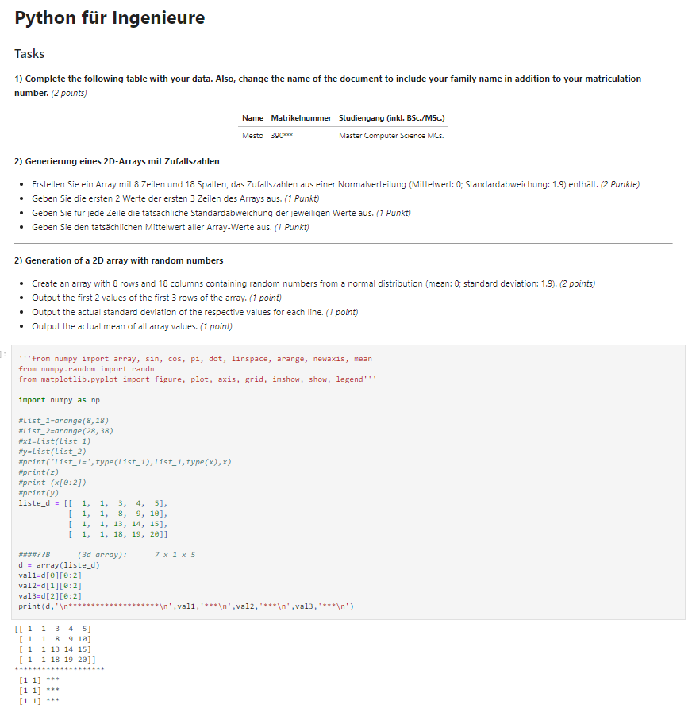
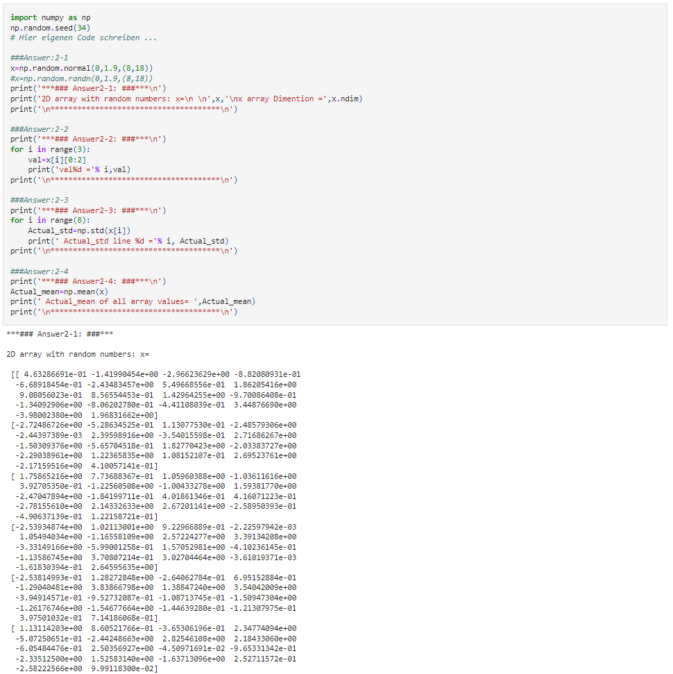
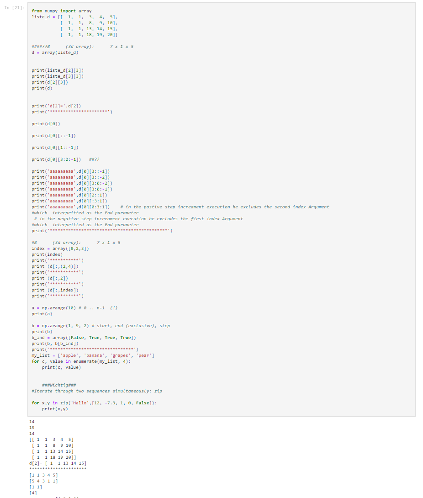
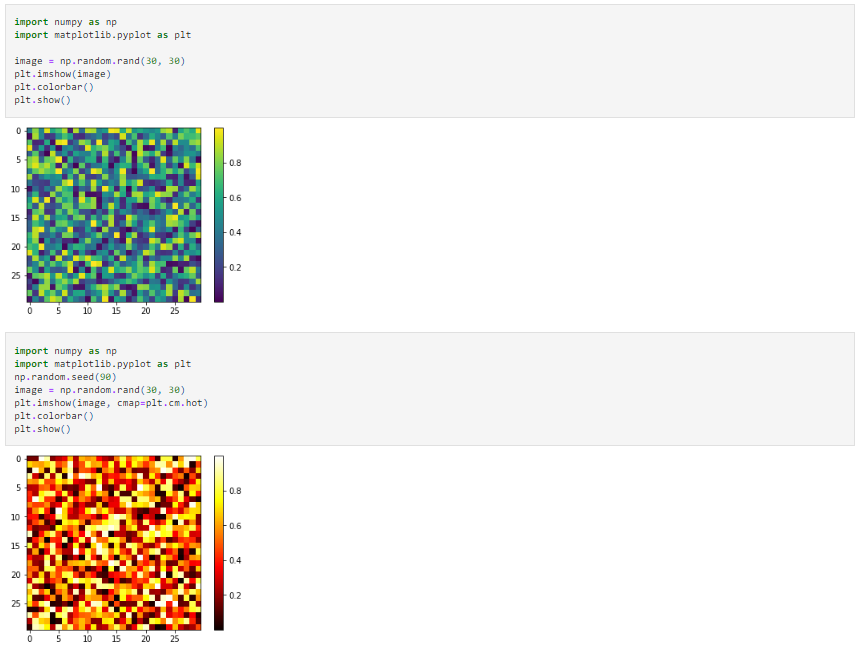
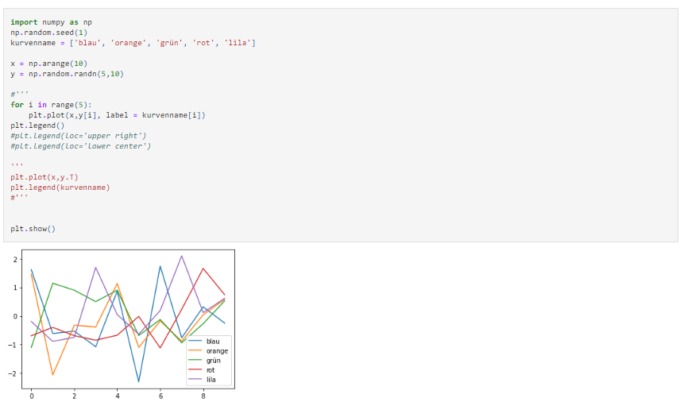
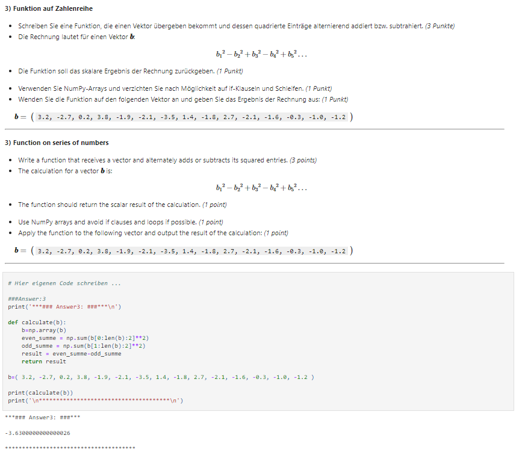

<table border=0>
<tr border=0>
<td>  </td>
  <td align="center"> <h5><a href="https://www.fokus.fraunhofer.de/en">by Strömungsmechanik und Technische Akustik
Technische Akustik.</a></h5> </td>
  <td>  </td>
</tr>
<tr border=0>
<td> </td><td  align="center"> <h5>Topic</h5> </td><td> </td>
</tr>
<tr border=0>
<td> </td><td> </td><td> </td>
</tr>
  <tr>
    <td> </td>
<td align="center"><h5><a href="https://www.akustik.tu-berlin.de/menue/home/">"Statistical-Analysis"</a></h5></td>
    <td> </td>
</tr>
  <tr>
    <td> </td>  <td align="center"><a href='https://www.linkedin.com/in/gert-herold-72306838/'>Dr. Ing. Gert Herold</a></td>
    <td> </td>
</tr>
</table>

 

# Statistical Analysis and Engineering Acoustics

by the Department of Engineering Acoustics.

# It took place in 2019 
 

